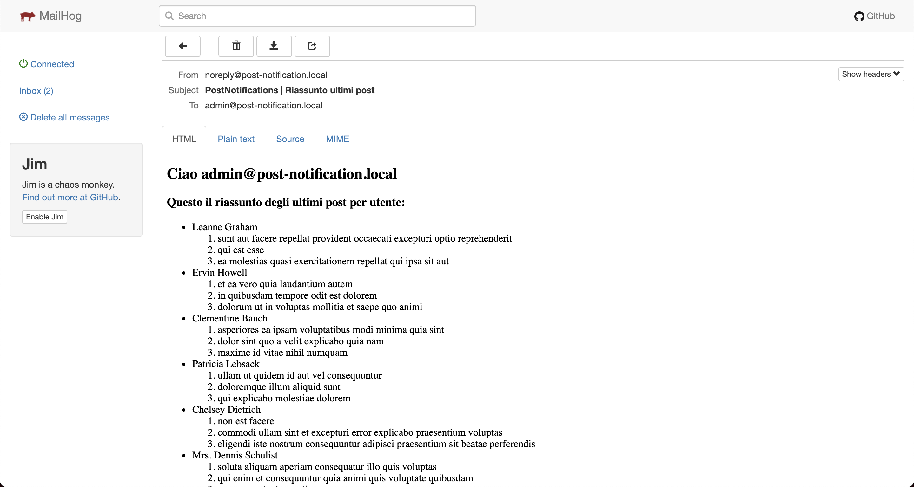

# Post Notifications

Sample project that expose read from APIs users and posts and trigger an email notification.


## Requirements

Create a tool that reads two API responses and sends an email.
The email should contain the posts written by every user. Please note that you should take only the first 3 posts.

E.g.

John Smith has written:
- Title 1
- Title 2
- Title 3

Paul Johnson has written:
- Title 1
- Title 2
- Title 3

--- 
- You can get the user list from this service: https://jsonplaceholder.typicode.com/users
- You can get the post list from this service: https://jsonplaceholder.typicode.com/posts
- To send email you can use https://mailtrap.io/ that gives you smtp credentials to send mail and catches all your attemps or similar service.


## Tech Stack

**Server:** Symfony 5.3

## Install

Start docker container with 

```bash
docker-compose up -d --build
```

and then, after enter into php-fpm container, run 

```bash
symfony composer install
```

## Running Tests

To run tests, run the following command

```bash
  symfony php vendor/bin/phpspec run -vvv
```

# Execute

Run main command with 

```bash
symfony console app:notification:send-user-posts
```

you can also pass following arguments:

* **limit**: Number of posts to show (default 3)
* **offset**: Initial position of posts to show (default 0)

```bash
symfony console app:notification:send-user-posts --limit=5 --offset=2
# or
symfony console app:notification:send-user-posts -l 5 -o 2
```

That produce follow email sent with Mailhog (http://127.0.0.1:18025/):



## Best-practice

* [PHP Coding Standards Fixer](https://github.com/FriendsOfPHP/PHP-CS-Fixer)
* [Conventional Commits](https://www.conventionalcommits.org/en/v1.0.0/)

## Authors

👤 **Fabiano Roberto**

* Twitter: [@dr_thief](https://twitter.com/dr_thief)
* Github: [@fabianoroberto](https://github.com/fabianoroberto)

  